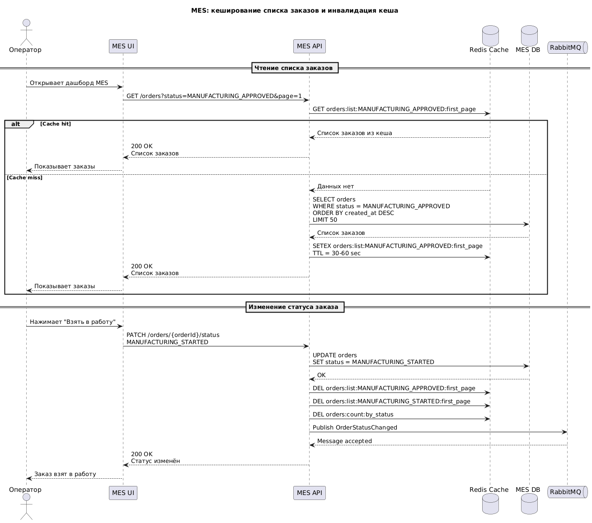

# Мотивация
Кеширование позволяет ускорить получения информации за счет того что нет вызова в базу данных. От такого страдает больше всего одна система, эта MES API т.к. операторы жалуются на долгую загрузку страницы для выбора нового заказа.
Требуется кэшировать:
1. Список новых заказов по статусу
2. Первую страницу дешборда операторов
3. Справочники если есть

Это позволит:
1. Страница для операторов будет открывать мгновенно (до 1 сек)
2. Операторы увидят новые заказы и смогут их быстро взять в работу
3. Снизится нагрузка на базу данных
4. Система станет более устойчивой к нагрузкам

# Предлагаемое решение
Следует выбрать серверное кэширование т.к. оператору нужно видеть актуальные данные, сохранять результат на стороне клиента нет смысла т.к. в системе может уже все измениться и оператор увидит старые данные полученные из браузера.

Паттерн кэширования лучше выбрать для этой ситуации Caсhe Aside.
1. Он простой для внедрения, а команда у нас маленькая
2. Не потребуется больших переделок в системе для внедрения (а скорость для бизнеса сейчас особенно важна)
3. Можно выборочно кэшировать данные

Write through
1. Усложнит и без того разбросанную логику обновления статусов т.к. надо будет обновлять сразу базу и кэш
2. Система не обладает той же гибкостью в вопросе сохранения данных и инвалидации что и Cache Aside подход

Refresh ahead
1. Намного сложнее в реализации
2. Может обновлять кэш в пустую
3. Избыточно для первого раза

| Временная инвалидация                                                                                                                                                                                                         | Инвалидация, основанная на запросах                                                                                                                                                                                                                                            | Инвалидация на основе изменений                                                                                              | Программная инвалидация                                                                                                                                      | Инвалидация по ключу                                                                                                                                                                         |
|-------------------------------------------------------------------------------------------------------------------------------------------------------------------------------------------------------------------------------|--------------------------------------------------------------------------------------------------------------------------------------------------------------------------------------------------------------------------------------------------------------------------------|------------------------------------------------------------------------------------------------------------------------------|--------------------------------------------------------------------------------------------------------------------------------------------------------------|----------------------------------------------------------------------------------------------------------------------------------------------------------------------------------------------|
| Самый простой способ, есть риски что данные уже устарели, кто-то обновил\забрал заказ и клиент увидит старую информацию поэтому нельзя использовать его напрямую. Но если говорим про какие-то справочники то можно это взять | Отличный метод, обновляем кэш только когда нужно но есть несколько нюансов. При таком подохде изменения должны быть только от запросов пользователей, а у нас существуют внешние интеграции которые могут упустить некоторые обновления и тогда оператор увидит старые данные. | Хорошо подходит, любое изменение будет учитываться для пересчета кэша (GUI или интеграция), может быть сложным в реализации. | Подходит для сложной бизнес логики, выборочный пересчет в зависимости от измененных данных. На данном этапе слишком сложно и не оправданно использовать его. | Может служить хорошим методом инвалидации кэша, но нужно граммотно подойти к выбору ключей чтобы не было слишком частого пересчета ключа, и при этом получаться всегда актуальную инфорамцию |

Предлагаю в качестве итоговой стратегии:
1. Использовать временную инвалидацию (60 сек) + инвалидация по ключу если опыт команды недостаточный, а так же мало времени
2. Использовать инвалидацию на основе изменений если достаточно времени для реализации и команда готова к этому.

[Диаграмма последовательностей](//www.plantuml.com/plantuml/png/lLLTQnDD5BwVNt78nNjNcbVHYq1gqsHjWzdc8ni_810ccx5PIBSnCxaG4TgAKgXG545lh7ZbRPJ6XjhMlp3xZtnsDjljHv3sHWZCPCvvpiVpdCCkIiK7QhZUOyfJFK6sLS-GFjBZO4TFWarzgd_eaJxH4pscO4l_nkCMp2FIXtZ71ITyI4_mWr_e_Gkt0pqAti1vBmusOeoxQcD0ARsFC6F47WNR-ZJOJ16NLEwB0OUPzL6EvtfzxYjAeHfg54C775TDkKfamyawNF4sbu9IDT7n9EMvsnN6Qcw9tI0BIw491tis5CCGnDjjJzbLysnN6SjcINz3WUDhD9_DCXOtG7CBg1KSxWDy56m6kuQJSR1DXfGT_JriMX-4LBD64Vwe7u1bow7vZK573EGzYAA6CcldLXltStcdKIkkBhTobKgj_D0g_DVdQoBxFsE00Htr5-4ZUARdIPMP3SuyzGPIjS8G4AId8ZHrFSM8QFflBgv9VvqsVQgFhYgk3nDnGx2fPzh-hNIQoW-Q_byY64mZWiJi8UKNs8nFmbm2n2CJFIccXQvxKiwi-uCPsfDWDtXDk216Kk42PCzGtIfP-PYnflzenQfP5F5EMPfDNjClrmfMZPQUa3iGN8bEYoigMFLyqoyLxQ93Tz9X7YIu5eV6zwAATSkn7jzCnwRlE2NKV3izTpTDKhZ_L0o_4-tA9pmVcsr9DWORW1qFNY7ZXPqPpTwOpp3-1FHucYYbtoF77YAy9GmSbcPabWSHK-Stfv9pyYlnxio_C6Unyt8-KhFfNsImxkHgZbLWxDmmD2g5d6ET3GD4I4PXDlgSmg3syYuMhDBDDBmHtjHmJRYxCVHLflsy5VLpLgXT1M_3Dg9tgHowreqzt-N-ckWmkvgqPmifaOEuwug-Wf7Ddgr4RTAJU1g2T_g4NPshZ_4iGDX8uyiACxQ8sSA7wGy0)
